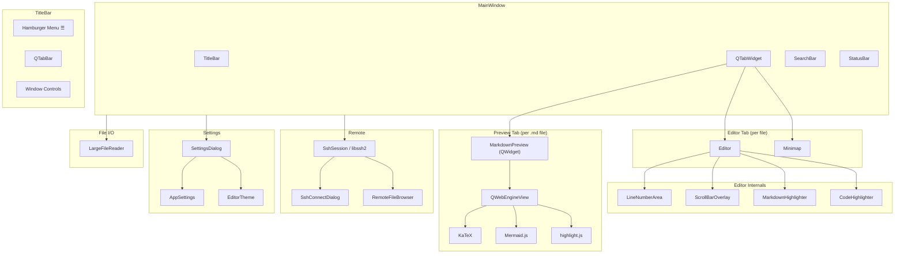
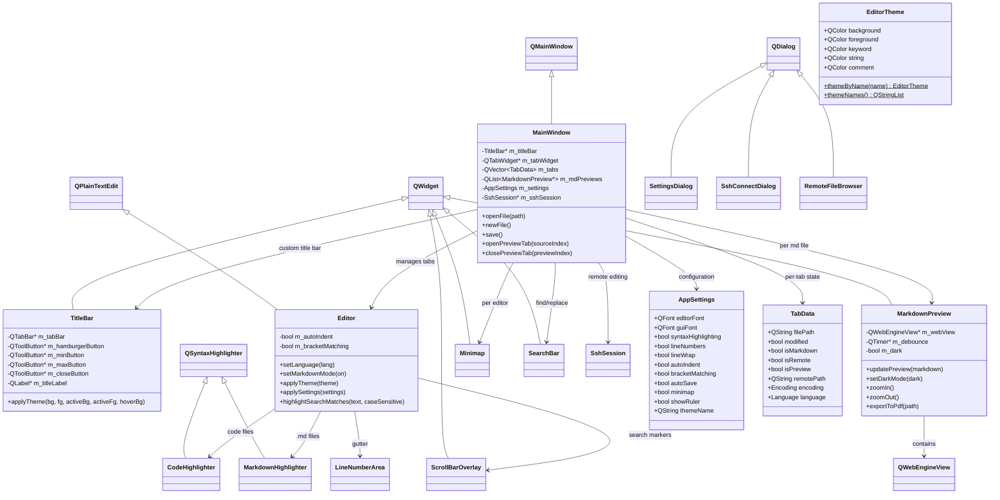
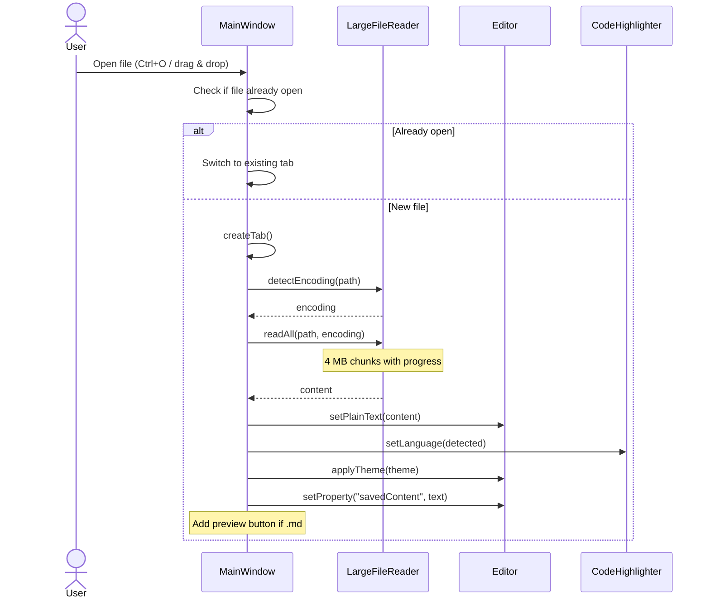
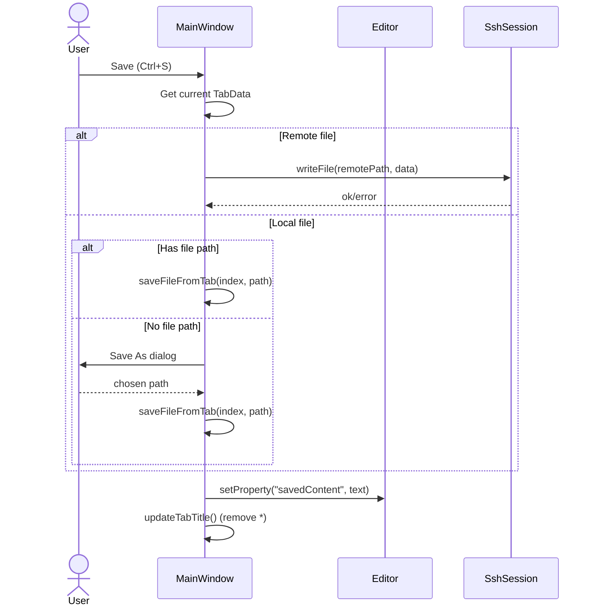
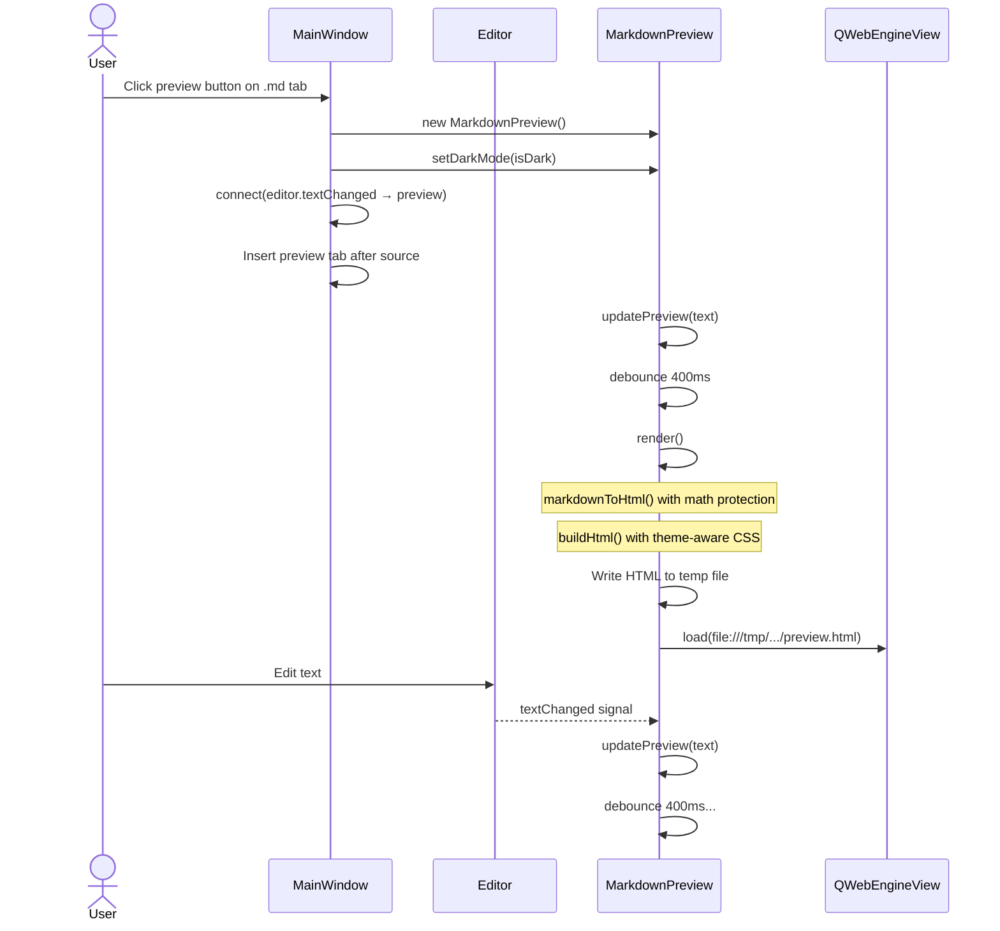
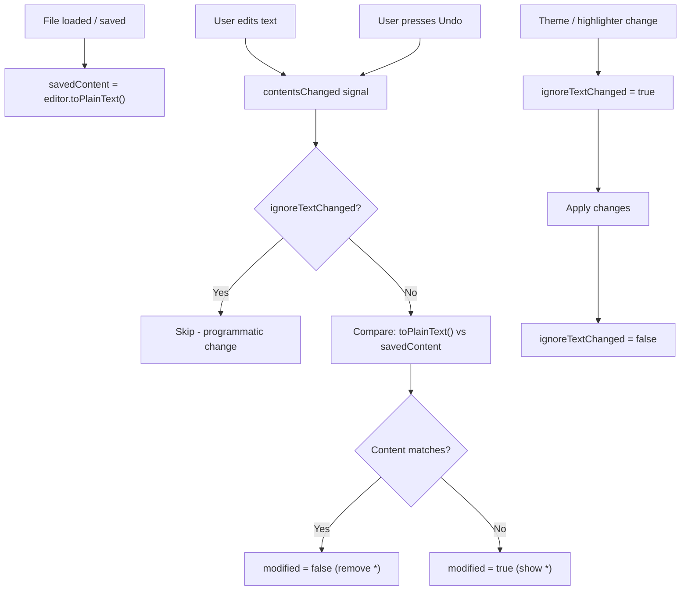
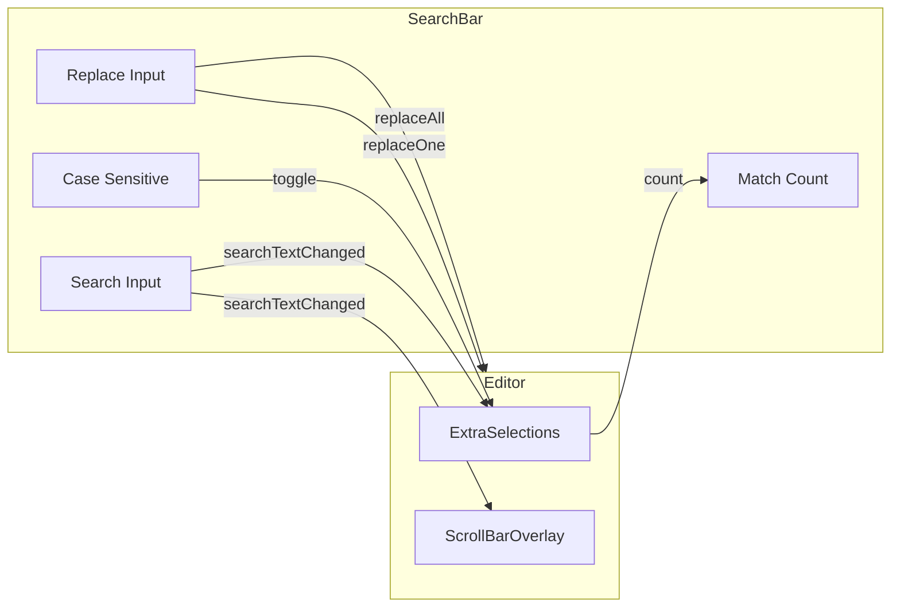
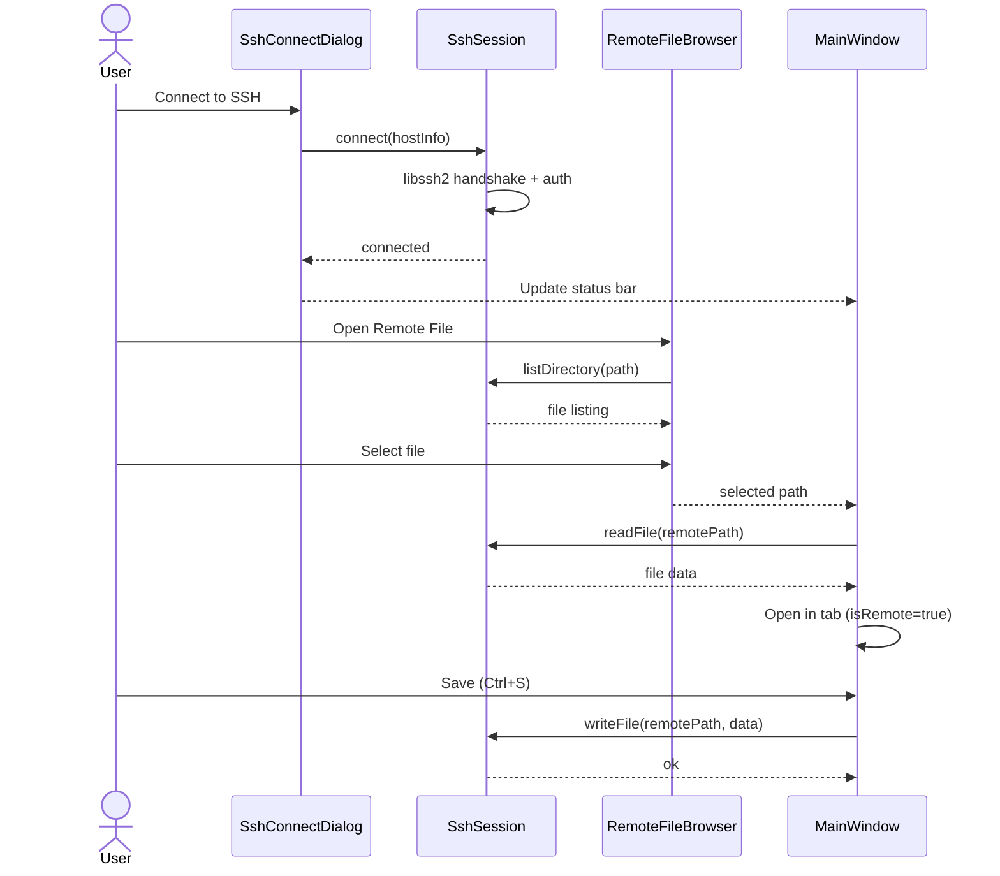
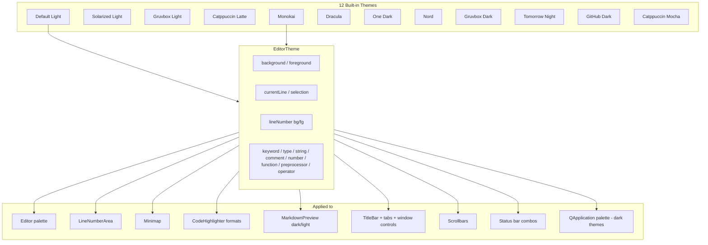
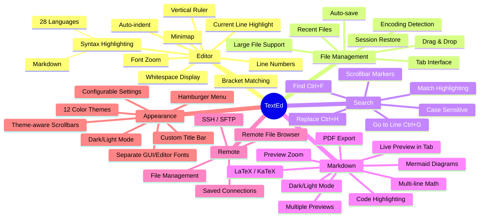

# Diagrams

Visual diagrams for TextEd architecture, features, and usage flows.

## Application Architecture

## Class Diagram

## File Open Flow

## Save Flow

## Markdown Preview Flow

## Modification Detection

## Search System

## SSH Remote Editing Flow

## Theme System

## Application Feature Map

